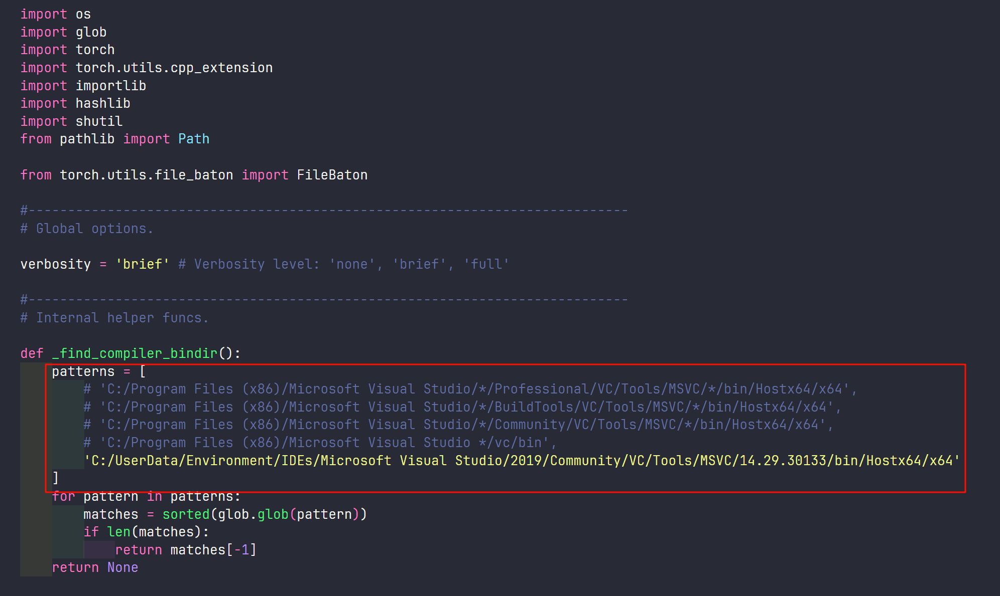

# MyDragGAN

> Reproduction of DragGAN paper

## Reproduction Steps

### 1. Get StyleGAN2

Already done. (See in `stylegan2_ada` folder)

StyleGAN is encapsulated in the `model.py`.

### 2. Set up the environment

Use both `conda` and `pip` to install all the libraries we need.

Always remember to check `stylegan2_ada\torch_utils\custom_ops.py`. Replace the content in the red box below with your own path.

### 3. Code the UI

1. `MainWindow` of my program can be found at `ui` folder. `mainwindow.ui` is the standard format for QT to design a UI. And `Ui_MainWindow.py` is generated by QT's uic tool. Check the last part of this README if you want to try it by yourself.
2. `components` folder contains all the custom components I need in my program.

    - `ConfigMainWindow.py` provide a easy way to prepare a config file for the UI.
    - `ImageLabel.py` provide a convenient way to show an image in different scale. Besides, it provides a painting function .
    - `ImageWidget.py` provide some controller of ImageLabel.
    - `LabelStatus.py` provide a special enum for ImageLabel component to control whether should painter work.

### 4. Code the Core of DragGAN

`DragGAN.py` shows the main logic of DragGAN. The most important parts are `motionSupervision` and `pointTracking` function. Also, Nearest module is not a module yet. Nearest's code is embedded in class `DragThread` and `ExperienceThread` which both contain `drag` function. Nearest's main logic show after these `if` code: `if self.DragGAN.is_optimize:`.

`metrics` folder contains all the code to calculate mean distance metrics and FID metrics.

## Start the program

`checkpoints` folder contains all the model file(*.pkl) we need. If there's no file, try to use `dowload_model.py`(python download), `download_models.sh`(shell download) or `download_models.json`(manually download) to download those files.

Use command `python MainWindow.py` to start the program.

Note: Only `cpu` and `cuda` have been tested in the device option.

## Bibliography

- [DragGAN: Towards Realistic Image Synthesis with Structured Latent Codes](https://arxiv.org/abs/2305.10973)
- [手把手教你实现DragGAN-代码无痛解读](https://zhuanlan.zhihu.com/p/640871357)
- [通过DragGAN,浅谈一下对GAN与diffusion model两种生成模型的一些思考](https://zhuanlan.zhihu.com/p/639829821)

## Generate py files from ui files

### design

pyside6-designer ./ui/mainwindow.ui

### generate

pyside6-uic ./ui/mainwindow.ui > ./ui/Ui_MainWindow.py
